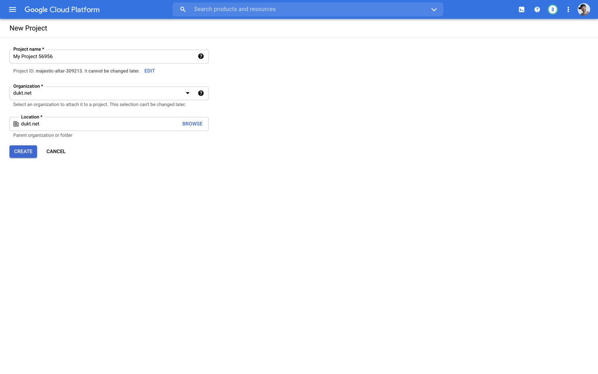

# Google

Follow these steps to configure Google for social login:

## OAuth Configuration


- Go to your Craft CMS control panel.
- Navigate to **Settings → Social → Login Providers**.
- Click on the “Settings” link of the Google login provider.


### 1. Check your domain name

For the authentication to work, Google requires that your domain ends with a public top-level domain (such as .com or .org).

Even when working locally, make sure that you are using an existing public top-level domain. Domains like `example.test` will not be accepted by Google.

In this example, we get around Google’s requirements by using a `.dev` domain locally, but that works since `.dev` became a public top-level domain in 2019.

### 2. Create the Google Developer Console project

- In another tab of your browser, open the [Google Developer Console](https://console.developers.google.com/).
- Click on the projects dropdown located next to the “Google APIs” logo.
- Click the “New project” button.
- Choose a project name and click “Create”.
- It might not automatically take you to your newly created project, so make sure that it's selected in the projects dropdown (next to the “Google APIs” logo).



### 3. Configure the OAuth consent screen

When connecting to your Google account, your website requests authorizations to access Google APIs. Google displays a consent screen to the user including a summary of your project and its policies, and the requested scopes of access. The consent screen needs to be configured for the authorization process to work properly.

- In the [Google Developer Console](https://console.developers.google.com/), navigate to **API & Services → OAuth consent screen**.
- Select the “User Type” that fits your needs, in this guide, we will choose “Internal”, and click “Create”.
- Fill the mandatory fields:
   - App name
   - User support email
   - Developer email address
- Click “Save and continue”.
- On the “Scopes” screen, don’t do anything and click “Save and continue”.
- Google then shows you a summary, click the “Back to dashboard” button.


### 4. Create the OAuth client

- Go to your Google Developer Console project.
- Navigate to **API & Services → Credentials**, click the “Create credentials” button and create a new “OAuth client ID”.
- On the next step, select the application type “Web Application” and choose a name for your web client.
- In the “Authorized JavaScript origins”, click the “Add URI” button.
- Copy the authorized javascript origin URL from the Social plugin OAuth settings, in your Craft CMS control panel.
- In the “Authorized redirect URIs”, click the “Add URI” button.
- Copy the authorized redirect URL from the Social plugin OAuth settings, in your Craft CMS control panel.
- Click “Save”.


### 5. Configure the OAuth client

Once the OAuth client is created, Google will provide you with a client ID and secret.

- Copy the client ID & secret.
- Go to your Craft CMS control panel.
- Navigate to **Settings → Social → Login Providers**.
- Click on the “Settings” link of the Google login provider.
- Paste the OAuth client and secret into the corresponding fields and click “Save”.


### 6. Enable the Google login provider

- Go to your Craft CMS control panel.
- Navigate to **Settings → Social → Login Providers**.
- Click the “Enable” button for the Google login provider.


### 7. Sign-in with Google

You are now ready to sign-in to Craft using your Google account.

🎉

## Default User Field Mapping

The Google login provider defines the following user field mapping by default.

```php
[
    'id' => '{{ profile.getId() }}',
    'email' => '{{ profile.getEmail() }}',
    'username' => '{{ profile.getEmail() }}',
    'photo' => '{{ profile.getAvatar() }}',
]
```

You can override and extend the default mapping using the [loginProviders](configuration.md#loginproviders) config.

## Profile Object
The profile response for the Google login provider is a [GoogleUser](https://github.com/thephpleague/oauth2-google/blob/master/src/Provider/GoogleUser.php) object.

### Methods
- `getId()`
- `getName()`
- `getFirstName()`
- `getLastName()`
- `getEmail()`
- `getAvatar()`
- `toArray()`